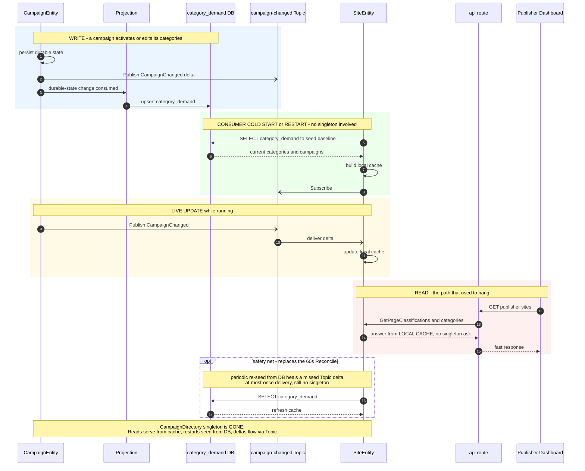

# CampaignDirectory Redesign — Remove the Singleton SPOF

**Status:** Phase-1 SHIPPED (2026-06-30, commit `371e058b`, deployed to k8s). The
ask→tell decoupling + SiteEntity durable demand cache + dashboard tolerance are live and
verified (a deliberate `singleton-0` restart recovers with **zero** `Ask timed out …
CampaignReady` storm; cluster reforms, registrations reconcile via backoff re-tell, no demand
stall). DEFERRED: campaign-biddable SSE channel, and the full `category_demand` projection
(only needed to delete the singleton outright). The singleton remains but is now *tenable* —
nothing synchronously depends on it.

## Problem

The publisher dashboard is *slow or never recovers* after an api/cluster restart,
while the advertiser dashboard recovers fast. Recurring for weeks; previous fixes
(probe tuning, replay-storm probe relaxation, dedicated singleton tier) did not end it.

## Root cause (proven from live cluster logs)

The **`CampaignDirectory` cluster singleton is wedged** during its post-restart
cold-start window — every synchronous `ask` to it times out (10s):

- `CampaignEntity … directory registration failed (Ask timed out … CampaignReady)` — all campaigns
- `SiteEntity publisher-programmer-llc failed to refresh demand categories: Ask timed out … GetAllCategories`

A cluster singleton is **unavailable by design** during failover/cold-start. The
dedicated singleton-tier work (#12) stopped *api/crawler rollouts* from migrating it,
but the singleton **node itself still restarts**, and each restart re-opens the wedge.

### Why it looks "publisher-only" (it isn't — it's a read-path asymmetry)

Advertiser entities fail **too** (CampaignEntity registration times out on the same
singleton). The difference is how each dashboard reads:

| | Read path | When singleton is wedged |
|---|---|---|
| **Advertiser dashboard** | Postgres **projections** (`DashboardRoutes`) + per-row `.recover` | renders fast, drops unready rows |
| **Publisher dashboard** | **entity asks** — `listSitesLogic` fans out 9×N asks to `SiteEntity` under all-or-nothing `Future.sequence`, no per-site `.recover`; `SiteEntity` is itself blocked retrying the wedged singleton; Go `coreGet` has no timeout | hangs 30s×N, blank until *every* site recovers |

So the advertiser side is **immune by architecture** (projections + per-row recover),
not healthy. The publisher side lacks both.

## What CampaignDirectory actually does (`modules/core/.../advertiser/CampaignDirectory.scala`)

1. **Aggregates** campaign→category registrations into a global index
   (`categories: Map[CategoryId, Map[CampaignId, …]]`, `fillerCampaigns`).
2. **Fans out** that index to `CampaignDistributor`/`CategoryBidderEntity`
   (`publishToCategories`, 60s `Reconcile`) — the demand the auction bids from.
3. **Serves reads** of the aggregate — `GetAllCategories` (SiteEntity),
   `GetFillerCampaigns` (Auctioneer), `GetCampaignsForCategory`.

Parts **1 and 3 have no reason to be a singleton** — derived, read-mostly aggregate
state. Part 2's *push* model is also the cause of the **post-restart ad dark window**
(CategoryBidder demand is in-memory and must be re-pushed after a restart).

## The redesign — demand as a replicated read-model, not a singleton's private state

Campaign category memberships are already persisted (CampaignEntity durable state).

- A **Pekko Projection** consumes campaign changes → maintains a `category_demand`
  table (category → campaigns, filler flags) in Postgres (durable baseline).
- **Consumers read it locally** and keep a cache fresh via the existing
  `campaign-changed` **Topic** (pub/sub). `AuctioneerEntity` *already* subscribes
  (`AuctioneerEntity.scala:79`); the bug is that `SiteEntity` still **pulls** via
  `campaignDirectory.ask(GetAllCategories)`.
- **No singleton on any read or hot path.** The CampaignDirectory singleton can be
  deleted.

### Topic alone is not enough (rigor)

Pekko `Topic` is **in-memory, at-most-once, no replay** — a subscriber only sees
messages published *after* it subscribed. "Broadcast once when up" leaves two holes:
a consumer that (re)starts after a broadcast gets nothing; while the singleton is
down there is no broadcast. The current 60s `Reconcile` is a band-aid over this —
and that 60s **is** the dark window.

**Robust combo: Topic for freshness + Postgres for durability.** Each consumer
**seeds its cache from the DB on its own startup** (not from the singleton, not
waiting for a broadcast), then keeps it fresh via Topic. A cheap periodic DB re-seed
replaces the singleton's `Reconcile` and heals any missed at-most-once delta.

## Sequence



## Phased plan

- **Phase 1 (small, immediate):** stand up the `category_demand` projection; point
  reads (`GetAllCategories`, fillers) at it; make `SiteEntity` subscribe+cache+seed
  instead of ask; make the publisher read path tolerant (per-site `.recover` +
  partial render; add a timeout to the Go BFF `coreGet`, `handler.go:338`).
  → publisher dashboard stops hanging, independent of the singleton.
- **Phase 2:** `CategoryBidderEntity` populates from the projection on start.
  → kills the post-restart ad dark window; the singleton's fan-out becomes redundant.
- **Phase 3:** delete the `CampaignDirectory` singleton.

**Decision:** projection-backed (Postgres) over DData (the team has been bitten by
DData remember-entities/LMDB quirks; projections are the proven-robust path).

## Phase 1 — concrete build

Split into 1a (stop the bleeding, smallest verifiable change) and 1b (the durable
foundation). Ship 1a first; it fixes the hang on its own.

### 1a — make the publisher read path tolerant (no new infra)

Goal: a wedged/recovering singleton degrades the dashboard to "fast page, some rows
recovering," never a hang. Mirrors what the advertiser path already does.

1. **`SiteEntity` — stop blocking reads on the singleton.** Today `SiteEntity.scala:393`
   does `campaignDirectory.ask(GetAllCategories)` and a failure stalls/retries while the
   dashboard waits. Make the refresh **best-effort with a cached fallback**: keep the last
   known `demandCategories` in state; on refresh-timeout, keep serving the cached value;
   never let `GetAllCategories` failure block a read (`GetConfig`/`GetPageClassifications`/etc.).
2. **`listSitesLogic` (`EndpointRoutes.scala:1856`) — partial render.** Wrap each per-site
   ask in `.recover { case _ => None }` and drop unready sites, exactly like
   `listCampaignsLogic` (`:1405`, `:1502`). No single `SiteEntity` should blank the page via
   `Future.sequence`.
3. **Go BFF `coreGet` (`handler.go:338`) — add a timeout.** Use a `http.Client{Timeout: 30s}`
   (the `corePost` client already exists at `handler.go:26`) instead of bare `http.Get`, and
   surface the error on the publisher pages instead of rendering a hung blank.

Verification for 1a: restart `singleton-0`; the publisher dashboard returns within seconds
(some sites may show "recovering") rather than hanging.

### 1b — the `category_demand` read-model (removes the dependency entirely)

**Schema** (`docker/init-db.sql` + a Slick table):

```sql
CREATE TABLE category_demand (
  category_id   varchar(255) NOT NULL,
  campaign_id   varchar(255) NOT NULL,
  advertiser_id varchar(255) NOT NULL,
  is_filler     boolean      NOT NULL DEFAULT false,
  status        varchar(32)  NOT NULL,
  updated_at    timestamptz  NOT NULL DEFAULT now(),
  PRIMARY KEY (category_id, campaign_id)
);
CREATE INDEX category_demand_category_idx ON category_demand (category_id);
```

(`is_filler` is per-campaign; a campaign with no matched categories but `bidOnUnmatchedContext`
gets a sentinel row, or use a small companion `filler_campaign(campaign_id)` set — decide at
build time.)

**Source of truth → table.** Two viable feeds; pick at build time:
- **(preferred) Projection over CampaignEntity durable-state changes** — a `ShardedDaemonProcess`
  projection (offset in the existing `projection_offset_store`) consuming durable-state changes
  and upserting/deleting `category_demand` rows per campaign. **VERIFY FIRST:** entities are
  durable-state (the `event_journal` is empty), so this needs the JDBC durable-state *change
  feed* (`changesBySlices`) enabled. If it isn't wired, either enable it or use the fallback.
- **(fallback) CampaignEntity direct write** — on category change and on recovery, the entity
  upserts its own rows (PK includes `campaign_id`, so no cross-entity contention) and deletes
  rows for categories it left. Simpler, no change-feed dependency; the entity re-asserts on
  recovery.

**Read-model repo** (`CategoryDemandRepo`, Slick): `allCategories(): Vector[CategoryId]`,
`fillerCampaigns(): Set[CampaignId]`, `campaignsForCategory(c)`, `snapshot()` for seeding.

**Consumer wiring (`SiteEntity`):** on start, seed `demandCategories` from
`CategoryDemandRepo.allCategories()`; subscribe to the existing `campaign-changed` Topic and
patch the cache on deltas (copy `AuctioneerEntity.scala:79`); add a periodic re-seed timer
(replaces the singleton's 60s `Reconcile`). Remove the `campaignDirectory.ask(GetAllCategories)`.

**Tests:** repo round-trip; projection/entity-write handler (add → upsert, remove → delete);
`SiteEntity` seed-on-start + Topic-delta patch; `listSitesLogic` partial-render with one site
failing.

After 1b, no read or hot path asks the singleton. CampaignDirectory still does the bidder
fan-out (until Phase 2), but is otherwise dead weight.

## Status of follow-ups

- **Post-restart ad-dark-window: FIXED & DEPLOYED** (2026-06-30, commit `f808aad9`).
  `CategoryBidderEntity` now SEEDS its demand from a durable `category_demand` table on startup
  (written by each `CampaignEntity` as it registers; read by the bidder in a `seeding` behavior
  that stashes bid requests until the seed lands). No projection was needed (none existed; the
  campaign-writes-its-own-rows approach is simpler and more decoupled). Verified: after an api
  restart the demo page fills within ~1–2s (no dark window); `category_demand` populates (27 rows /
  25 campaigns); no ask-storm / demand-stall. Filler demand still flows via
  `CampaignDirectory.GetFillerCampaigns` (separate, smaller path — not seeded).
- **Deleting the singleton: still MOOT** — it's non-blocking/tenable; removal would be cleanliness
  only. Not planned.

## Verification bar (do not declare "fixed" without this)

Restart the singleton node and confirm the publisher dashboard renders **fast
(partial, "recovering" rows)** *through the failover window* — not just "looks fine now."
(Done for Phase 1: a deliberate `singleton-0` restart recovered with zero ask-storm.)

## Related code

- `modules/core/src/main/scala/promovolve/advertiser/CampaignDirectory.scala`
- `modules/core/src/main/scala/promovolve/publisher/SiteEntity.scala:393` (the offending `ask`)
- `modules/core/src/main/scala/promovolve/auction/AuctioneerEntity.scala:79` (Topic.Subscribe — the pattern to copy)
- `modules/api/src/main/scala/promovolve/api/EndpointRoutes.scala:1856` (`listSitesLogic`, all-or-nothing fan-out)
- `platform/internal/handler/handler.go:338` (`coreGet`, no timeout)
- `modules/api/src/main/scala/promovolve/api/projection/DashboardRoutes.scala` (advertiser projection pattern to mirror)
