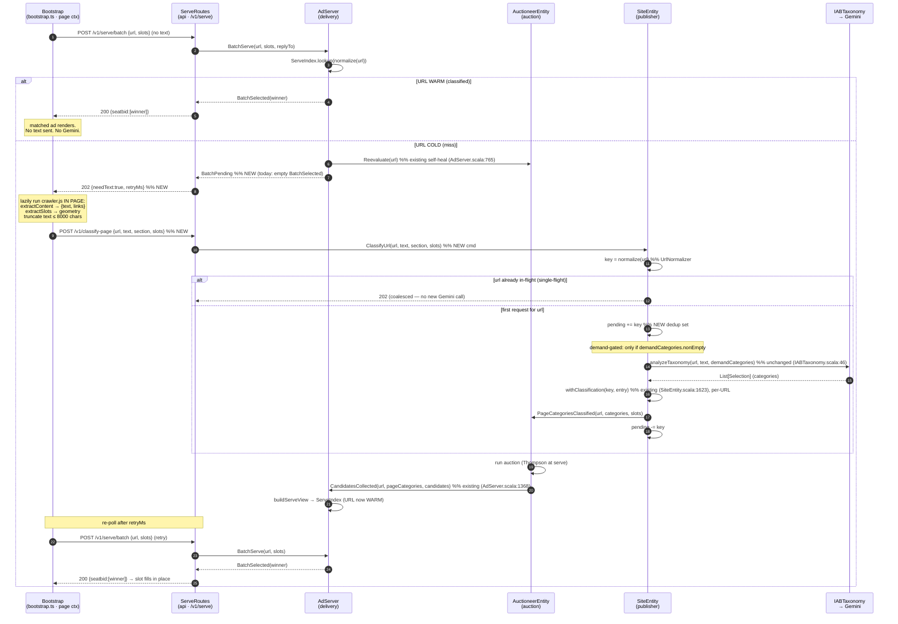

# On-Demand Page Classification (Crawl-Free Classification)

> **Status:** BUILT (Phase 1 live since 2026-06-23). This document captures the
> decisions from the design discussion; implementation followed in phases.
> 2026-07-12 addition: Reevaluate-miss per-URL recovery — the auctioneer asks
> `SiteEntity.GetPageClassification` when its in-memory page cache lost the
> announce (commit 35e5467), closing the lost-announce gap.
>
> **Related:** [`CONTENT_CLASSIFICATION.md`](CONTENT_CLASSIFICATION.md) (the
> classifier itself), [`PERIODIC_AUCTION_DESIGN.md`](PERIODIC_AUCTION_DESIGN.md)
> (periodic auction + recency window), and the crawler subsystem
> (`modules/browser/`).

## Problem

> **Historical.** The crawl described below no longer exists — the dedicated
> crawler tier was removed 2026-07-02, and on-demand classification (this
> design) is what runs today. Kept as the motivation for the design.

Today, page text for classification is obtained by **crawling**: a Playwright
crawl walks a site from its `seedUrl` via recursive link-following (BFS,
`maxDepth=2`, `maxPages=1000`, 30-min timeout) and extracts text from each page,
which is then classified by Gemini.

For a large news site this is expensive and wasteful:

- A newspaper homepage at depth-2 reaches **thousands** of article URLs. Each
  nightly crawl bottoms out at the 1000-page cap or the 30-min timeout — i.e. it
  spends its **entire budget on a near-arbitrary slice**, not on "done".
- The dominant cost is a **Gemini classification call per page**, re-paid nightly,
  much of it on churned article URLs that will never serve an ad.
- The Gemini path is **rate-limited (~8 RPM free tier, `GeminiRateLimiter`)**;
  bursty crawls already time out past the acquire deadline and fall back to
  low-confidence generic categories (see `CONTENT_CLASSIFICATION.md`).

The crawl is "bounded brute force": it won't run away, but it spends its whole
budget indiscriminately and re-pays it every night.

## Core idea

**Decouple text acquisition from classification.** Classification (Gemini) stays
exactly as-is; only the *source of the page text* changes.

```
TODAY:    Playwright crawl (fetch page, extract text)  →  Gemini classify(text → categories)
                    ↑ the expensive part                       ↑ keep, unchanged

PROPOSED: ad tag extracts text in the live page        →  Gemini classify(text → categories)
                    ↑ free — JS already runs in the page       ↑ same call, unchanged
```

The ad tag (bootstrap JS) already runs in the publisher's page and has the full
DOM. Have it extract `{text, links, slots}` and send a text snippet with the
serve request. Then:

- **No Playwright crawl of content pages** — the page hands us the text.
- **Gemini still classifies** — once per unique page (URL), triggered only by
  pages that actually get traffic, text supplied free.
- The scheduled deep crawl shrinks to an optional homepage/section **cold-start
  seed**, or is removed entirely.

## Key decisions

1. **Gemini classification is kept.** This is non-negotiable — it produces the
   IAB categories that drive matched auctions. Only the text source changes.

2. **Text comes from the ad tag, not a crawl.** Reuse the crawler's existing
   extraction JS (`modules/browser/src/main/resources/crawler.js`:
   `window.extractContent`, `window.extractSlots`) so serve-time text is
   **byte-for-byte** what the crawler would have produced → classification
   parity, no drift, single source of truth.

3. **Extraction runs in the bootstrap, not the banner.** `extractContent` is
   pure DOM (`document`, `window.location`, `querySelectorAll`). It must run in
   `platform/banner-bootstrap/src/bootstrap.ts` (top page context, full
   article-DOM access) — **not** the banner component
   (`platform/banner-component/`), which is an isolated Shadow-DOM unit that
   cannot see the parent article.

4. **Keying: per-page (exact, normalized URL) — same as today.** Classification
   is a property of the **page**, not the slot: one serve request carries one
   `url` + several `imp` slots, and **all slots on that page share the page's one
   classification** (`BatchServeReq` in `ServeRoutes.scala:72`). So one Gemini
   call per URL covers every slot on it.

   On keying parity: in Phase 1 there is **one source** for the URL — the live
   serve request. Write (miss → store under `normalize(url)`) and read (next
   serve → look up `normalize(url)`) take the same URL through the same routine on
   the same server, so they match by construction; there is no crawler-view-vs-
   browser-view gap to reconcile. The only thing to ensure is that the serve path
   **runs `UrlNormalizer`** so same-page-different-decoration visits collapse to
   one key (`/a?utm_source=x` and `/a?utm_source=y` → one classification, both
   readers warm). Optional nicety: prefer `<link rel="canonical">` when present.
   The URL must also be the real page hosting the slots, within the **verified
   site host**, and within the **48h recency window** (else 204 per
   `PERIODIC_AUCTION_DESIGN.md`). Cross-source parity (crawler-discovered URL must
   equal the later browser URL) only matters for **Phase 3 link-graph pre-warm**,
   where redirect/canonical handling earns its keep.

   **Query params: denylist, never strip-all.** `UrlNormalizer`
   (`UrlNormalizer.scala:8`) already strips a denylist of known tracking params
   (`utm_*`, `fbclid`, `gclid`, …), sorts the rest, and **keeps everything else**.
   Keep it that way — do NOT strip all params: some params *are* the content
   selector (`?p=12345`, `?id=`, `?lang=ja`, `?page=2`, `?q=`), and stripping them
   silently merges distinct pages onto one key and serves one page's categories to
   all of them. Rule: an unknown param *kept* costs at most a redundant
   classification (cache miss); an unknown param *stripped* causes a wrong-hit
   (wrong categories served) — so default-keep, denylist-only. Optional tweak:
   extend the denylist (`ref`, `igshid`, `gclsrc`, `_ga`, `yclid`, `mkt_tok`, …).

   An earlier draft proposed "template/section" keying so new articles inherit a
   warm key and never miss. **Dropped:** template = layout, not topic (two
   articles on one template can be SPORTS vs FINANCE — reuse would mislabel
   them), and even *section*-level keying sacrifices the per-article precision
   that is the product's pitch. It is **not necessary**: text-on-impression
   solves the crawl cost regardless of keying; 48h recency bounds volume;
   single-flight collapses per-URL bursts into one call. Section-keying is a
   **contingency cost-lever only if** per-page Gemini volume later exceeds the
   rate budget *and* raising the limit (paid key) isn't an option — see Appendix.
   Keeping exact-URL keying leaves `pageClassifications` / `ServeIndex` /
   `lastPage` unchanged and makes template-detection moot.

5. **Single-flight classification is mandatory.** No in-flight dedup exists
   today. A breaking story's first traffic burst would fire hundreds of
   identical Gemini calls and blow the RPM budget. A per-URL pending set in
   `SiteEntity` must coalesce concurrent requests for the same URL into one call.

6. **The serve path never blocks on Gemini.** An LLM call is ~1–5s; ad tags time
   out well under 1s, and blocking would couple ad-serving latency/availability
   to the LLM. The serve path stays a fast cache lookup.

7. **Cold-window fill order:** matched (steady state) → **unmatched /
   run-of-network auction** (category gate relaxed; any non-category-gated
   campaign can still win and pay) → house ad (per-site opt-in, if configured) →
   **204**. House ad is optional infrastructure, not required; 204 is the
   zero-config default.

8. **Deferred fill via client re-poll (phase 2).** When a cold miss happens, the
   first serve returns `202 pending`; the ad tag holds the slot and re-requests
   after ~1–2s, by which time classification has completed and the slot fills
   **in place on the same pageview** (no reload). This is "wait until Gemini
   completes" done client-side, non-blocking — *not* a synchronous server hold.

9. **Link-graph pre-warm (phase 3, optional).** `extractContent` already returns
   the page's links. A reader on the homepage hands us the homepage text + every
   article link on it; pre-classify those linked URLs in the background before
   they're clicked. Normal navigation (homepage → article) then finds the
   article already warm. Crawl-free predictive prefetch, scoped to reachable
   pages.

## Bonus: better slot signals for free

`extractSlots` keys on `[data-promovolve-slot]` — the **same markers publishers
already place**. Running it client-side yields the **real rendered slot
geometry** (above-fold, viewability fraction, region) from the actual visitor's
viewport, which is truer than the crawler's synthetic headless render. This
improves slot priors as a side effect.

## Payload: two-phase, text sent only on a cold miss (decided)

The bootstrap does **not** send page text on every request — that would ship
~8KB on every (mostly warm) impression for text the server ignores on a hit, and
only the server knows cold-vs-warm. Instead, the server **pulls** text when it
needs it:

1. Serve request carries only `{url, slots}` — tiny, same as today.
2. Warm → `200 matched` (no text ever sent, no client extraction).
3. Cold → `202 {needText:true, retryMs}`; the bootstrap *then* lazily extracts
   and POSTs `{url, text, section, slots}`.

The cold/warm decision is **per-URL**: a URL already classified returns `200`
immediately with no text request; only a genuinely new URL triggers the text
round-trip. Cost is one extra round-trip on cold misses, which already fill late
via re-poll anyway.

## Sequence (Mermaid)



> Cold-window option: instead of an empty slot during the `202 → re-poll` gap,
> the `202` can carry an **unmatched/run-of-network** filler (or house ad) so the
> slot is never blank. 204 only if even the unmatched auction draws no bid.

## Call path per component

**Bootstrap** — `platform/banner-bootstrap/src/bootstrap.ts` (top page context)
- `serve(url, slots)` → `POST /v1/serve/batch {url, slots}` *(no text)*
- on `200` → hand winner to banner component (`expandable-magazine-banner.js`)
- on `202 {needText, retryMs}` *(NEW)*:
  - `window.extractContent([hostRegex, "body", opts])` → `{text, links}` *(from `crawler.js`)*
  - `window.extractSlots()` → slot geometry
  - truncate `text` to **8000** chars → `POST /v1/classify-page {url, text, section, slots}` *(NEW)*
  - `setTimeout(retryMs)` → `serve(url, slots)` again → fills in place
- *(Phase 3)* report `links` for link-graph pre-warm

**ServeRoutes** — `modules/api/.../ServeRoutes.scala`
- `POST /v1/serve/batch` → parse `BatchServeReq` (`:72`) → `adServer ? BatchServe` → `BatchSelected`→**200**, `BatchPending`→**202** *(NEW mapping)*
- `POST /v1/classify-page` *(NEW; existing `/classify` takes pre-computed categories, not text — not reusable)* → `siteEntity ! ClassifyUrl(...)` → **202**

**AdServer** — `modules/core/.../delivery/AdServer.scala`
- `BatchServe(url, slots, replyTo)` → `ServeIndex.lookup(normalize(url))`
  - hit + candidates → `replyTo ! BatchSelected(winner)`
  - miss/empty (`:1937`) → `selfHealReauction(url)` *(existing `:765` → `AuctioneerEntity.Reevaluate`)* → `replyTo ! BatchPending` *(NEW; today returns empty outcomes)*
- `CandidatesCollected(url, …, pageCategories, …)` (`:1368`) → `buildServeView` → update `ServeIndex`

**AuctioneerEntity** — `modules/core/.../auction/AuctioneerEntity.scala`
- `Reevaluate(url)` / `PageCategoriesClassified(url, categories, slots, ts)` → upsert `lastPage[normalize(url)]` (`:958`) → run auction → `adServer ! CandidatesCollected(...)` (`:1366`)

**SiteEntity** — `modules/core/.../publisher/SiteEntity.scala`
- `ClassifyUrl(url, text, section, slots)` *(NEW cmd)*:
  - `key = normalize(url)` *(reuse `UrlNormalizer`)*
  - if `key ∈ pending` → no-op *(single-flight, NEW)*
  - else `pending += key`; gated on `demandCategories.nonEmpty` *(existing demand-gate)* → `ctx.pipeToSelf(iabTaxonomy.analyzeTaxonomy(url, text, Some(cats)))` → `ContentAnalyzed` *(existing `:854`)*
- `ContentAnalyzed(...)` *(existing)* → build `ClassificationEntry` → `state.withClassification(key, entry)` (`:1623`, per-URL) → `auctioneer ! PageCategoriesClassified(...)` → `pending -= key`

**IABTaxonomy** — `modules/core/.../taxonomy/IABTaxonomy.scala`
- `analyzeTaxonomy(url, text, categoryOverride)` (`:46`, **unchanged**) → Gemini via `GeminiRateLimiter` + circuit breaker → `List[Selection]`

## Net effect vs. today

| Dimension | Today (crawl) | Proposed |
|---|---|---|
| Playwright fetches | thousands/site/night | **0** (content pages) |
| Gemini calls | per crawled URL, nightly | once per URL, ever, traffic-triggered |
| Cold window | n/a (pre-crawled) | per new URL once, fills late via re-poll |
| Trigger | scheduled brute force | real traffic |
| RPM pressure | bursty crawl, times out | bounded by distinct fresh URLs + single-flight |

## Feasibility findings (verified against code)

**Already exists / reusable:**

- Serve path can fire async side-effects — `AdServer.selfHealReauction`
  (`AdServer.scala:765`) already does `sharding.entityRefFor(...) ! msg` on a
  serve miss. The classify-on-miss path mirrors this.
- Cold-page handling exists — miss → empty outcomes + self-heal re-auction
  (`AdServer.scala:1937`). Today returns 200 `winner:null`; making it 202/204 is
  trivial.
- `pageClassifications` cache + LRU (10k cap) + recovery replay
  (`SiteEntity.scala:1623`, `withClassification`).
- Demand categories in actor memory (`SiteEntity.demandCategories`);
  classification is demand-gated already.
- Extraction JS is a standalone resource (`crawler.js`), not a Scala string —
  shareable with the client build.
- 48h recency window already bounds what gets classified/served
  (`PERIODIC_AUCTION_DESIGN.md`).

**Net-new work:**

- Serve-request text/section field (`BatchServeReq` in `ServeRoutes.scala:72`
  carries only `url + slots + pins` today).
- Ad-tag change in `bootstrap.ts` to run `extractContent`/`extractSlots` and
  send the snippet (truncate to **8000 chars** = Gemini `MaxContentLength`).
- `SiteEntity.ClassifyUrl(url, text, section, …)` command calling the unchanged
  `analyzeTaxonomy(url, text, demandCategories)` (the existing `/classify`
  endpoint takes *pre-computed* categories, not text — not reusable as-is).
- **Single-flight pending set** in `SiteEntity`, keyed by normalized URL (none
  exists). This is the load-bearing new piece for rate-limit safety.
- Ensure the serve path runs `UrlNormalizer` on the request URL (the cache key).
- Build plumbing to share `crawler.js` across the JVM-resource and the Vite/TS
  bootstrap bundle (copy-at-build to start; promote to a shared package later).
- Client re-poll + in-place fill (phase 2).

## Open questions

1. ~~**Template/section detection**~~ **MOOT** — keying is per-URL (decision #4),
   so no template/section derivation is needed. (Section-level keying is a
   deferred contingency only; see Appendix.)
2. **Text spoofing / trust** — the page now supplies the classification text. A
   publisher could send misleading text to attract high-value categories. Impact
   is mostly intra-publisher (which of *their* eligible advertisers fill);
   cross-publisher abuse is the real concern. Mitigations TBD (sampling re-crawl
   audit? bound category influence?).
3. ~~**Payload size**~~ **DECIDED: two-phase.** Serve request carries only
   `{url, slots}`; server returns `202 {needText}` on a cold (per-URL) miss;
   bootstrap then POSTs text to `/v1/classify-page`. Warm serves never send text.
   See "Payload" + sequence above.
4. **Seed crawl** — keep a thin homepage/section cold-start seed, or go fully
   serve-driven? Thin seed avoids the homepage itself being cold on first hit.
5. **Cold-window fill** — confirm unmatched-auction is desired over plain 204,
   and whether a per-site house-ad creative concept is worth adding now.

## Implementation status (branch `on-demand-classification`)

**Phase 1 — BUILT + VERIFIED LIVE (2026-06-23) on the Docker-Desktop k8s cluster.**
Three-tier e2e (`scripts/verify-on-demand-classification.sh`) all green: cold
serve → `needText:true`; `POST /v1/classify-page` → `202` (+ a duplicate call,
single-flighted); after Gemini classify + auction → warm serve → `needText:false`.
Logs confirmed the full chain (classify → "📊 Categories ranked eligible=3" →
"🎯 Auction COMPLETE winners=1" → AdServer caches pageCategories → `needText`
flips). **Key gotcha found:** the site must be created with a `SiteConfig`
(`taxonomyIds`) so the IABTaxonomy *assistant* initializes — a force-verified-only
site has `assistant=None`, so `ClassifyUrl` returns `not_ready` and never calls
Gemini. The pre-existing pre-computed `/classify` path never needed the assistant,
so this is new surface that on-demand classification depends on.

**Phase 1 — components:**

- `SiteEntity.ClassifyUrl(url, text, section, slots)` command — reuses the
  existing `PageContent → analyzeTaxonomy → ContentAnalyzed` path via a shared
  `triggerClassification` helper. Single-flight via transient
  `pendingClassifications` (normalized url); `FailedToAnalyzeContent` now carries
  the url so the slot releases on failure. Decision logic extracted to pure
  `ClassifyDecision.decide` (pending > not_ready > accept).
- `POST /v1/classify-page` (`ClassifyPageTextReq`) — ad-tag-facing, fires
  `ClassifyUrl`, returns `202` (never blocks on Gemini).
- Cold signal: `AdServer` sets `BatchSelected.needText=true` only on a serve miss
  with **no record** of the url (not in `ServeIndex` nor `pageCategoriesCache`);
  threaded to `BatchServeRes.needText`.
- `bootstrap.ts`: gated on `needText`, runs a **bounded** DOM text walk
  (`requestIdleCallback`, early-truncate at 8000 chars) and POSTs
  `/v1/classify-page`.
- `OnDemandClassificationSpec` — 7 pure tests (decision precedence +
  normalized-key collapse/separation).

**Deviations from the original plan, and why:**

- *Client uses a self-contained bounded extractor, NOT shared `crawler.js`.* In
  the on-demand model the crawler no longer classifies content pages, so
  byte-for-byte parity only matters for the Phase-3 seed/pre-warm crawl. A
  bounded TS walk (no link collection, early-truncate) is simpler, has no
  JVM↔Vite build plumbing, and is bounded by design. Revisit sharing if/when
  Phase 3 lands.
- *Cold-window fill is currently plain empty/204, not an unmatched auction.* The
  `needText` signal + the existing empty-outcomes path ship first; routing the
  cold window through an unmatched auction is deferred (open question #5).
- *Slot priors (per-slot floor scaling) are not produced after the crawler strip
  — DEFERRED.* The crawler fed `SlotPrior` (position/viewability → ±50% floor
  scaling) via `extractSlots`. On-demand `classify-page` currently sends only
  slot `id/w/h`, not the position signals, so **new** slots get no prior and fall
  back to the flat site floor; **existing** slots keep their persisted priors and
  the manual admin override still works. Fix when needed: carry `extractSlots`
  position signals (above-fold/viewability/region) in `classify-page` and rebuild
  `SlotPrior` server-side (truer than the crawler's synthetic render). Parked for
  now — "can't fill per-slot floors without the crawler" is accepted.
- *URL normalization parity on the serve path is not yet wired.* Serve lookup and
  classify store both use the raw `window.location.href` today, so they are
  self-consistent (a cache hit works); the single-flight key is normalized. Full
  `UrlNormalizer` on the serve/store path is still owed so tracking-param
  variants of one page don't each classify.

## Freshness: timestamp token (replaces the `needText` boolean)

`needText: Boolean` only answers "cold or not." Replace it with a **timestamp
token** — `reclassifyInMs` (relative, to dodge client clock skew) — that answers
"how long is this page's context good for":

- `reclassifyInMs > 0` → fresh; the client does **nothing**.
- `reclassifyInMs <= 0` (or absent) → the client extracts text and POSTs
  `/v1/classify-page`. This covers **both** the cold case (never classified) and
  the **stale** case (classification aged out) with one field.

**Anchor + window — attention-based (chosen):**
`token = classifiedAt + RECLASSIFY_WINDOW` (≈ the existing 48h content-recency
window). `classifiedAt` is when the page was last classified, so it **resets on
re-classification**. Consequences:

- A page is classified once on first visit, served for the window, then expires.
- An **expired page that gets re-visited just re-classifies** → another window.
  This is *not* a bug to prevent — a re-visit means the content is getting
  attention again, so it's worth monetizing; the cost is one Gemini call, and
  only for pages people actually re-read (bounded by real traffic). A truly dead
  page (no traffic) never re-classifies because nobody visits it.
- So "reactivation" is just a normal cold-classify after expiry. No immutable
  anchor, no anti-reactivation guards needed.

**Client distinction (cold vs stale) falls out of winner-presence:** render the
winner if present (always); send text iff `reclassifyInMs <= 0`. A served-but-
expired page (winner present + token ≤ 0) refreshes in the background while still
showing the current ad (stale-while-revalidate); a never-classified page (no
winner + token ≤ 0) is cold until warm. The token alone drives the send; winner-
presence only decides whether there's an ad to show meanwhile.

**The token must ride EVERY stale-shaped response (bug fixed 2026-07-14):**
the batch serve path had one branch that dropped it — candidates present but
ALL older than the freshness window replied a bodyless `BatchContentTooOld`
204. No body means no token, the tag never re-classified, re-auctions kept
restamping the old `classifiedAt`, and the page stayed dark permanently (first
observed on the static demo site, which crossed the 48h window with no ad-tag
visit to heal it). That branch now replies a normal `BatchSelected` with no
winners and a `<= 0` token, exactly like the empty-pool branches — stale
context still never serves, but the next real visit heals the page.

**Server needs `classifiedAt` at serve time** even for no-winner (filler) pages
→ `pageCategoriesCache` becomes `url → (categories, classifiedAt)` (the
`CandidatesCollected` message already carries `classifiedAt`). The token is then
computable in every serve branch.

**Optional strict variant (publish-anchored):** if "only monetize content
published in the last 48h" ever becomes a hard product promise, anchor on an
**immutable** `publishedAt` (extracted client-side from `<meta
article:published_time>` / dateline, else first-seen-and-never-reset) so a
re-visited old article does NOT reactivate (`publishedAt + 48h` stays in the
past). Costs: publish-date extraction + a client pre-check (don't POST if already
stale). Deferred unless that strict positioning is required — the attention-based
model above is the default.

## Phased plan

- **Phase 1 — crawl-free, per-URL classification.** Serve-request `needText` flow
  (two-phase: text only on cold miss); `bootstrap.ts` bounded extractor;
  `ClassifyUrl` command; **single-flight by normalized URL**. *Built — see above.*
  Remaining: serve-path `UrlNormalizer`, cold reply = unmatched auction, live
  end-to-end verification.
- **Phase 2 — deferred fill.** `202 pending` + client re-poll + in-place fill so
  cold misses still serve matched on the same pageview.
- **Phase 3 — link-graph pre-warm + seed-crawl removal.** Pre-classify linked
  URLs from visited pages (here cross-source URL parity / redirect handling
  matters); shrink/remove the scheduled deep crawl.

> Per-URL first-misses are inherent but cheap: text-on-impression removes the
> crawl; **single-flight** collapses a story's traffic burst into one Gemini
> call; the unmatched-auction fallback keeps the cold impression non-empty;
> re-poll (Phase 2) fills it matched a beat later; pre-warm (Phase 3) makes new
> URLs rarely cold at all.

## Appendix — section-level keying (deferred contingency)

Only if real traffic shows per-URL Gemini volume exceeding the rate budget *and*
raising the limit (paid key) isn't an option: key classification by **section**
(a topic grouping) instead of exact URL, so new articles in a known section
inherit its categories and skip a Gemini call. Cost: coarser categories — a
section approximation rather than per-article precision (the product's pitch), so
this is a last resort, not a default. **Template** (layout) is never a valid
key — it carries no topic signal.
