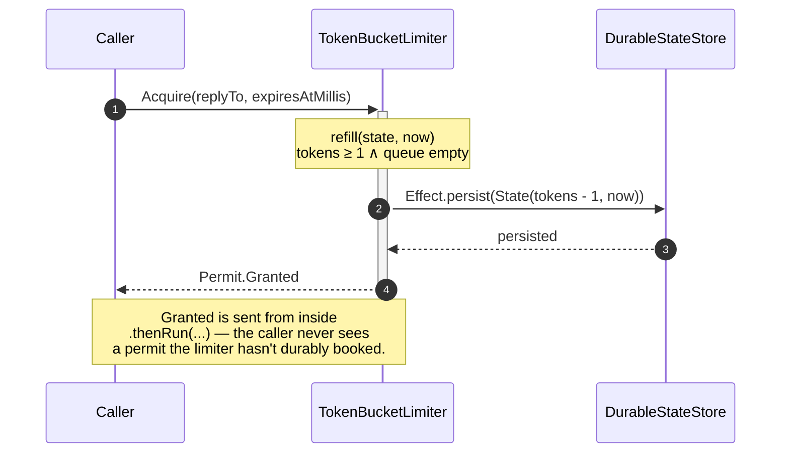
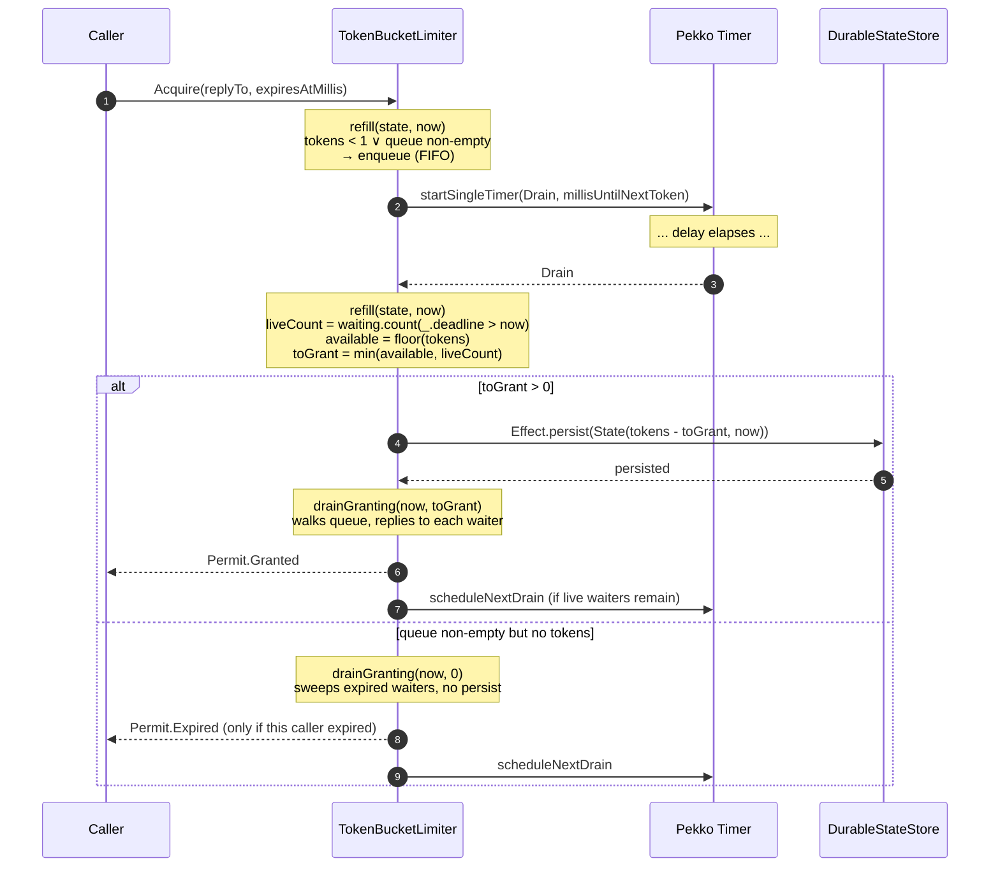
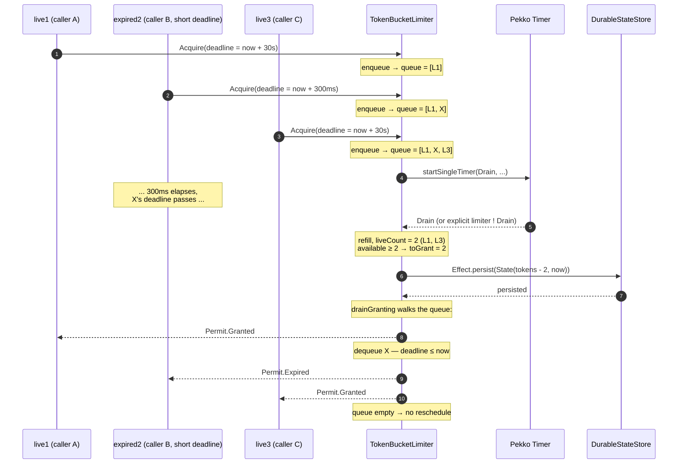
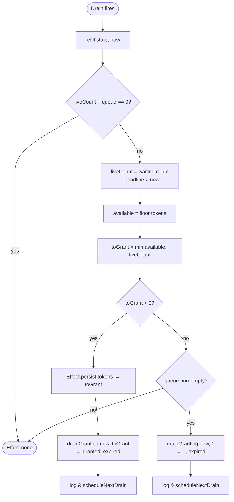

# TokenBucketLimiter — sequence diagrams

Visual reference for the actor's request/response flow, the lazy-refill +
FIFO queue + auto-`Drain` interplay, and why `drainGranting` walks the
whole queue rather than the prefix.

See `TokenBucketLimiter.scala` for the implementation. This doc is
strictly explanatory.

## 1. Fast path — tokens available, queue empty

## 2. Queue path — bucket starves, caller waits for a Drain cycle

## 3. Mixed queue — expired waiter sitting in the middle (the fix)

This is the case the original code got wrong. Earlier `queueSnapshot`
counted only the *expired prefix*; with `[live1, expired2, live3]`
that returned `(0 expired, 3 live)`, and the prefix-drain dequeued
all three in order — granting `expired2` even though its deadline had
passed. `drainGranting` walks every entry and classifies each waiter
by its own deadline.

The same shape, drawn pre-fix, would have ended with `Permit.Granted`
being sent to `X` and the bucket persisting `tokens - 3` even though
only two live waiters were honored — and the third granted was an
already-expired caller whose `ask` had already timed out client-side.

## 4. Drain decision flow

## Invariants

1. **No `Granted` before persistence.** Every `Granted` reply is sent
   inside `.thenRun(...)`, after `Effect.persist(next)` resolves. A
   persist failure can never leak a permit the journal hasn't booked.
2. **FIFO among live waiters.** `drainGranting` walks the queue in
   insertion order; the first N live waiters get the N available
   tokens, regardless of intervening expired entries.
3. **Expired never `Granted`.** A waiter whose `expiresAtMillis ≤ now`
   always gets `Permit.Expired`, never `Permit.Granted`, regardless
   of position in the queue.
4. **Lazy refill, always clamped.** Tokens are recomputed from elapsed
   time on every command; the actor doesn't tick on a fixed schedule
   just to advance the bucket. Only token-changing transitions persist.
   The clamp to `settings.maxTokens` runs on **every** read — including
   when the clock hasn't advanced or when the persisted count was
   loaded over-cap (cap shrank between restarts). No caller ever
   observes a bucket over the current cap, independent of whether
   `ClampToCap` has run yet.
5. **Ephemeral waiter queue.** The queue lives in actor memory only.
   On singleton failover any pending `ask` future times out and the
   caller's normal retry path takes over — persisting the queue would
   buy nothing because reply refs only complete on the actor system
   that issued the ask.
6. **`startSingleTimer` replaces.** Re-arming Drain with the same key
   is intentional — only one outstanding wake-up is needed at a time.
7. **`ClampToCap` is journal-convergence only.** Runtime correctness
   after a cap shrink is guaranteed by invariant #4 — `refill` clamps
   every read. `ClampToCap` exists solely so the journal itself
   converges to the new cap. Without it, an idle limiter would keep
   reloading the pre-shrink count on every restart until the first
   organic `Acquire` wrote a new state. With it, the journal is
   self-healing within one signal-handler pass post-recovery.
