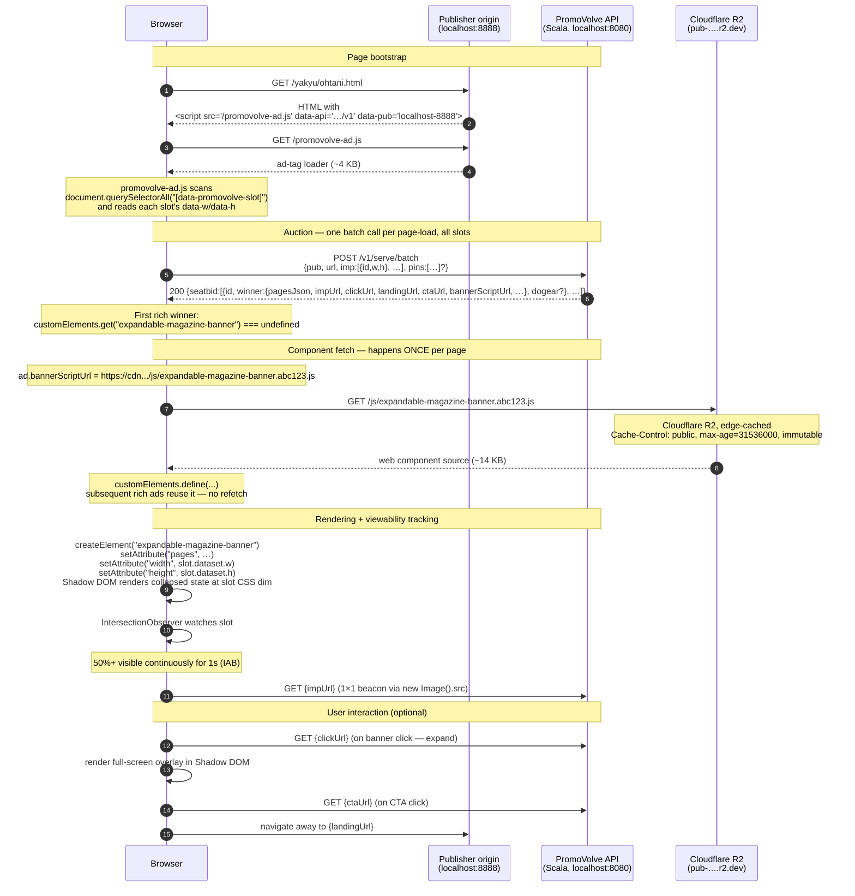
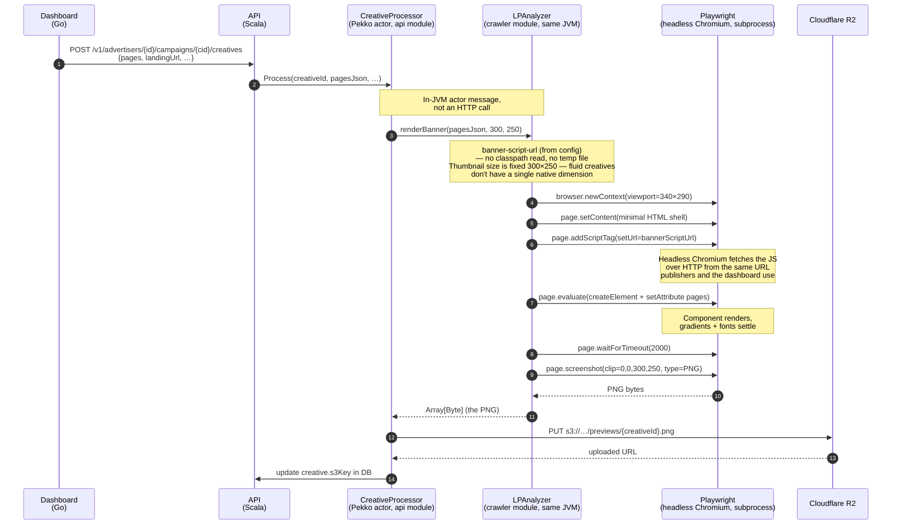

# banner-component

Source for `<expandable-magazine-banner>` — the Shadow DOM web component that renders PromoVolve's expandable magazine-style rich creatives.

## Why this module exists

Historically the component lived as a single hand-maintained `expandable-magazine-banner.js` file duplicated across four locations (platform/static embed, crawler JAR classpath, publisher-site-ja copy, compiled target/classes). Each edit had to be propagated manually, and the classpath copy required a Scala rebuild to go live — a footgun that burned an hour the last time we changed it.

This module is the single source of truth. `npm run release` builds a minified IIFE bundle, uploads it to Cloudflare R2 under a content-hashed filename, and rewrites `BANNER_SCRIPT_URL` in `scripts/.env`. Every consumer — publisher ad-tag, dashboard editor, crawler Playwright — fetches from the same URL.

## Consumers

One artifact, three consumers, one URL:

| Consumer | How it gets the URL |
|---|---|
| Publisher ad-tag (`promovolve-ad.js`) | From `/v1/serve` response field `bannerScriptUrl` (set per-request by the API from `banner-script-url` config) |
| Go dashboard editor (`creative-design.html`) | Template variable `{{.BannerScriptURL}}`, sourced from the `BANNER_SCRIPT_URL` env var on the Go process |
| Crawler Playwright (`LPAnalyzer.renderBanner`) | `banner-script-url` config value, passed to `page.addScriptTag({ setUrl })` |

All three point at the same hashed URL on Cloudflare R2. There's no JAR classpath copy anymore; no fanout; no Go `//go:embed` copy. `npm run release` is the only way new bytes reach any consumer.

## Layout

```
platform/banner-component/
├── src/                # TypeScript source (web component + helpers)
├── tests/              # Vitest unit tests; Playwright visual tests later
├── scripts/fanout.mjs  # Post-build copy into consumer paths
├── dist/               # Build output (gitignored)
├── package.json
├── vite.config.ts      # Library mode, IIFE, minified
├── tsconfig.json       # Strict TS
└── eslint.config.js    # Flat config, typescript-eslint
```

## Workflow

```bash
cd platform/banner-component
npm install            # first time only

npm run dev            # vite watch build; regenerates dist/ on save
npm run build          # one-shot production build
npm run publish:r2     # upload dist/ to Cloudflare R2 (requires R2_* env)
npm run release        # typecheck + lint + build + publish:r2 (recommended;
                       # rewrites scripts/.env BANNER_SCRIPT_URL, then
                       # restart API + dashboard to pick up the new URL)

npm run test           # vitest
npm run typecheck
npm run lint
```

`publish:r2` reuses the same credentials the JVM's `R2ImageStorage` reads (`R2_ACCOUNT_ID`, `R2_ACCESS_KEY_ID`, `R2_SECRET_ACCESS_KEY`, `R2_BUCKET`), so if the backend can write to R2, so can this. No separate CI pipeline needed — publishes go directly from the dev machine.

Each publish computes a SHA-256 of the bundle bytes, uploads as `js/expandable-magazine-banner.<10-char-hash>.js` with `Cache-Control: public, max-age=31536000, immutable`, and rewrites `BANNER_SCRIPT_URL` in `scripts/.env` to the new URL. Restart the API and the Go dashboard (`scripts/run-dev.sh` + `scripts/run-dashboard.sh`) and every consumer — publisher ad-tag, dashboard editor, crawler Playwright — starts fetching the new bundle on the next request. Because the URL changes with content, there's no stale-cache window: browsers either have the exact bytes (cache hit) or they don't yet have them (cache miss, new fetch).

## No framework

Deliberately vanilla TypeScript — no React, no Vue, no Lit. The component runs inside publishers' pages via Shadow DOM; shipping a framework runtime there would add weight for no benefit. Web Components + `container-type: size` + CSS container queries is the right primitive for fluid, aspect-preserving creatives.

## How the component reaches consumers

Three consumers load the bundle today: the **publisher page** (via the ad-tag), the **Go dashboard** (via a templated URL), and the **crawler's Playwright browser** (for generating PNG previews at creative-approval time). The API is currently the single origin for all three — served from its classpath.

### 1. Publisher page load



### 2. Crawler preview generation

Separate lifecycle: triggered **once per creative approval**, not per page view. The crawler renders the banner in a real headless Chromium, screenshots it, and uploads the PNG to R2 as a fallback image (used when rich rendering is disabled or unavailable).



The crawler is an in-process consumer; there's no HTTP hop between `CreativeProcessor` and `LPAnalyzer`. The only network traffic that matters here is the upload to R2. Playwright itself is a subprocess — its browser reads the JS from a local temp file, not over HTTP.

### Rough edges

- **Step 3 of the publisher flow is on the API critical path.** Every first-time page view spends one round-trip on a ~14 KB static asset delivered from the Scala origin. A CDN POP would serve it from a geo-edge.
- **`?v=Date.now()` cache-bust** defeats the `max-age=86400` header every time. Content-hashed filenames (`expandable-magazine-banner.[hash].js`) let us replace that with `max-age=31536000, immutable`.
- **Component source lives on the `crawler` module's classpath**, which is semantic drift — the crawler is named for LP scraping, not ad delivery. The resource ended up there only because `crawler` is the lowest common ancestor in the SBT dependency graph (`api → core → crawler`), so it's the only module visible to both readers. A CDN URL removes the classpath dependency entirely and the naming question disappears.
- **Crawler writes the JS to a temp file** on every `LPAnalyzer` construction. Switching `addScriptTag` from `setPath` to `setUrl=${BANNER_SCRIPT_URL}` eliminates that — Playwright fetches the same URL publishers and the dashboard use, which happens to be the CDN in prod.

## Future work

- ~~**Phase 1**: monorepo-local bundle, manual fanout to two paths.~~ **Done.**
- ~~**Phase 2**: drop the `platform/static/` copy. Dashboard references the API URL. Fanout collapses to one target.~~ **Done.**
- ~~**Phase 3a**: `BANNER_SCRIPT_URL` env var drives all three consumers (crawler, publisher ad-tag via `/v1/serve` response, Go dashboard template).~~ **Done.**
- ~~**Phase 3b**: R2 upload via `npm run publish:r2` — Node script uses `@aws-sdk/client-s3` with the same credentials the JVM uses.~~ **Done.**
- ~~**Phase 3c — content-hashed filenames**: publish script computes a SHA-256 hash and uploads as `js/expandable-magazine-banner.<hash>.js` with `Cache-Control: public, max-age=31536000, immutable`. Updates `scripts/.env` in place.~~ **Done.**
- ~~**Phase 3d — delete classpath path**: removed `modules/crawler/src/main/resources/expandable-magazine-banner.js`, `EndpointRoutes.componentJsRoute`, and `scripts/fanout.mjs`. Banner deploys fully decouple from Scala deploys.~~ **Done.**
- **Failure mode** if CDN is briefly unreachable during a crawler screenshot: the approval retries. Crawler is not on the serving hot path, so the tradeoff is acceptable.
