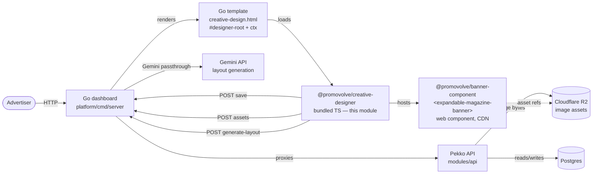
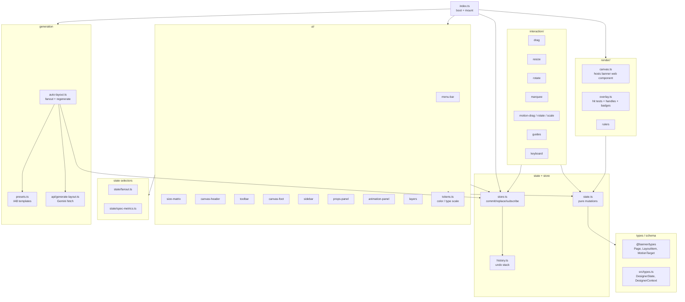
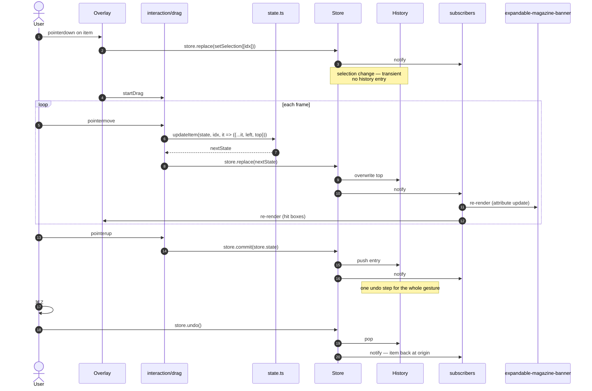

# Creative Designer — Design Notes

`FLOWS.md` answers "what happens when". This doc answers "why is the
module shaped this way".

Each section is a load-bearing decision with its rationale. Skim the
diagrams first, then read the decisions whose boundaries you're about
to touch.

---

## 1. System context



**Boundaries that matter:**
- **Designer → Banner** is a web-component boundary. The designer never
  touches banner internals; it only sets attributes (`pages`, `width`,
  `height`, `mode="edit"`) and reads `shadowRoot` for one narrow case
  (auto-sizing text heights on first paint).
- **Designer → Go** is four POST endpoints: save, asset upload, asset
  import-from-URL, layout generation. No WebSockets, no SSE. The module
  is effectively offline between those calls.
- **Designer → Pekko** goes *through* Go. Client never sees Pekko URLs.

---

## 2. Module topology



**Seams:**
- Everything downstream of `state.ts` reads via selectors (`currentPage`,
  `currentLayout`, `isSelected`, etc.) — nothing reaches into
  `state.pages` directly except those selectors and `updateItem`.
- `interaction/*` only depends on `state` + `store` + DOM coord
  utilities. It never imports from `ui/*` or `render/*`. That lets
  gestures be tested with a mock Store and no DOM chrome.
- `ui/*` modules export `mount*(host, store)` and return a `{ update }`
  handle. Each one is self-contained — delete it and the rest still
  compiles.

---

## 3. Data model

### Page × mode

A creative is a list of `Page`s. Each page has one **master layout**
(the 16:9 `page.layout`) plus optional **sized-banner overrides**
keyed by IAB size (`page.banners[sizeKey]`). Same page, eleven
possible layouts:

```
Page {
  headline, sub, body, img, ctaUrl, isCTA, …     ← content fields
  layout: LayoutItem[]                            ← Expanded PC (16:9)
  banners: {
    "mobile-expanded": LayoutItem[],              ← Expanded Mobile (9:16)
    "300x250":         LayoutItem[],              ← IAB sizes
    "728x90":          LayoutItem[],
    …
  }
}
```

### LayoutItem

Discriminated union by `type`: `text` | `image` | `rect` | `circle`.
All share a base with position (`left`, `top`), size (`width`,
`height` or `radius`), rotation, opacity, and the designer-side
flags `locked` / `hidden`.

```
LayoutItem (base)
  left, top              %  of container
  width, height          %  (rect, text, image)
  radius                 %  (circle)
  rotation               degrees
  opacity                0..1  (base state, before animationTo)
  animationTo?           MotionTarget  — tween end state
  ctaTarget?             click hotspot on CTA pages
  locked?, hidden?       designer-side flags
  _generated?            auto-layout flag, stripped on edit
```

### DesignerState

The full editor state; `History<DesignerState>` wraps it for
undo/redo.

```
DesignerState
  pages: Page[]                ← content
  pageIdx: number              ← view
  mode: Mode                   ← view
  selectedItemIdxs: number[]   ← view
  zoom: number                 ← view
```

Four of five fields are **view state**. That's deliberate — see
decision §4.4.

---

## 4. Load-bearing design decisions

### 4.1 Banner rendering is a web-component boundary

The canvas doesn't render items itself; it hosts
`<expandable-magazine-banner>` and sets attributes. The same
component is what publishers actually embed in production. **One
render path, not two** — so a creative looking right in the designer
implies it looks right served.

**Trade-off:** we can't reach into the banner's internals for
editor-only behaviour. The auto-sizing text pass
(`canvas.ts::autoSizeTextItemHeights`) is the one exception — it
queries the shadow DOM once after first paint, computes each text
item's natural height as a %, and stamps it back into state. That's
the only place a reader should expect shadow-DOM intimacy.

### 4.2 Percent coordinates everywhere

`left`, `top`, `width`, `height`, `radius` are all % of the container.
Nothing is in pixels.

**Why:** the same `layout[]` renders at 1600×900 in the editor, at
the publisher's chosen slot size (300×250, 728×90, …) when served,
and at an arbitrary zoom level in the canvas. Pixel coords break in
at least one of those. Percent coords are invariant under scale —
a 25%-wide item is 400px on 1600, 75px on 300.

**Consequence:** hit testing, snap-to-grid, marquee, guides all work
in % too. `itemBoundsPct` is the single truth; the coord layer
(`coords.ts`) converts client pixel → % exactly once per gesture.

### 4.3 Replace vs commit — gesture = one undo step

Every state change funnels through `store.replace(next)` (transient)
or `store.commit(next)` (undoable). The pattern for every gesture:

```
pointerdown  → snapshot origins
pointermove  → compute next state → store.replace
…            → paints every frame
pointerup    → store.commit(store.state)  ← one history entry
```

**Why:** 60 drag frames shouldn't yield 60 undo entries. `replace`
overwrites history's top; `commit` pushes a new entry. Pressing Cmd+Z
walks back one *gesture*, not one *frame*.

**How to apply:** if the user expects Cmd+Z to undo it → `commit`.
If the system fires it many times per second → `replace`. Selection
changes go through `replace` too (§4.4). Consult `drag.ts` as the
canonical example.

### 4.4 Selection is view state; undo skips it

`selectedItemIdxs`, `mode`, `pageIdx`, `zoom` are in `DesignerState`
but every mutation that changes only view state uses `replace`, so
they never form a history entry.

**Why:** the user's mental model of "undo" is "undo my content
edit", not "undo my click". A selection change that became an undo
step would make Cmd+Z rewind past what the user was about to undo.
Also avoids history bloat from accidental clicks.

**How to apply:** any function named `selectItem` / `setSelection`
/ `toggleSelect` / `switchMode` / `switchPage` / `setZoom` should
be paired with `store.replace`, never `store.commit`.

### 4.5 Three layout sources: presets, templates, Gemini

At boot, every empty `(page, mode)` cell is filled by
`installAutoLayoutGenerator`. There are three sources, picked in this
order:

1. **Hand-crafted presets** (`presets.ts`) — IAB sized slots
   (300×250, 728×90, …). Deterministic, read the page's content fields
   (`headline`, `sub`, `img`), always produce a readable result.
2. **Curated layout templates** (`layout-templates.ts`,
   `template-apply.ts`) — when the LP-to-Creative flow's first step
   has a `templateId` picked, expanded PC / Mobile use the template's
   `items[]` verbatim instead of calling Gemini. The brand kit is
   layered on top (§4.11).
3. **Gemini auto-layout** (`api/generate-layout.ts`) — fallback for
   expanded PC / Mobile when no template is picked. The server resolves
   `brandKitJson` and `templateId` into the prompt before calling the
   model.

**Why three:** LLMs don't nail compositions at tiny or odd aspects.
728×90 is a wafer; the model will happily hand you a 14pt headline in a
three-column grid — so IAB sizes never go to Gemini. Expanded variants
(16:9, 9:16) have room for genuine design choices, but authors often
want a known starting point (templates) rather than rolling the dice
on the LLM. Templates also feed Gemini *prompts* via
`slotsAsPromptLine`: the `slots[]` view (role + region, aspect-agnostic)
is what the LLM sees, so a single template generalises across sizes.

**Why two views per template (`items[]` and `slots[]`):** the picker
needs concrete coordinates to render a preview and apply on click; the
LLM prompt needs aspect-agnostic composition intent. Keeping them
separate lets each evolve without dragging the other along — the
items[] is one realised example of the slots[] for a typical aspect.

**Consequence:** "Regenerate this size" is currently a visual no-op
on IAB because the preset is idempotent. The fix is to split the
two canvas-header buttons so "Regenerate" always calls Gemini and
"Reset" always calls the preset (queued but not wired).

### 4.6 Per-mode layouts, not one responsive layout

`page.layout` (expanded) and `page.banners[sizeKey]` (sized) are
independent arrays. Editing the 300×250 doesn't touch the 16:9.

**Why:** responsive layout for ad units is a losing battle. A
composition that works at 1600×900 (headline left, photo right)
doesn't translate to 320×50 (headline alone, tiny). Letting each
size have its own hand-tuned layout is simpler than a constraints
engine that'd still need manual overrides for edge cases.

**Cost:** more storage (11× layouts per page), more fanout work on
first save, and the "authored vs auto-layout vs empty" fanout
status pill to track it all (`state/fanout.ts`).

### 4.7 Hidden items keep their array slot

Toggling the eye icon on a layer sets `item.hidden = true`. The item
**stays in `state.pages[i].layout[idx]`** — the renderer sets its
opacity to 0, overlay skips its hitbox, marquee skips it.

**Why:** every layer index is a stable identity. Banner uses
`data-layout-idx="${i}"`; overlay uses `data-cd-idx`; layers panel
keys by idx. Removing the item on hide would shift every subsequent
index and invalidate those references. Setting opacity 0 preserves
index stability.

**How to apply:** don't filter items for rendering. Transform them
(opacity 0), or skip them at the interaction layer.

### 4.8 `_generated` flag, stripped on edit

Auto-layout output is tagged `_generated: true`. The moment
`state.ts::updateItem` runs, it strips the flag. This drives the
size-matrix "authored vs auto-layout" fanout status pill and makes
the "this size still needs review" UX possible without a second
state field.

**Why:** authors want to know which sizes they've looked at. Naively
you'd store a `reviewed` bool per (page, mode) cell, but that
requires explicit user action to flip. Tagging auto-output and
stripping on any edit means the flag is automatically accurate —
any touch of any item promotes the whole size to "authored".

### 4.9 Save is a form POST, not fetch

`save.ts` builds a hidden `<form>` and submits it rather than
`fetch`-ing and handling the response.

**Why:** the Go handler redirects after save. Letting the browser's
form submission machinery follow the redirect gives a full-page
reload with the new URL and refreshed state, no client-side
navigation code needed. For a save flow that's both the end of an
editing session and the entry into the next page, that's cleaner
than an SPA-style diff-and-patch.

**Cost:** no inline "saving…" spinner; you lose the ability to show
partial errors without reloading. Acceptable for now.

### 4.10 Styling is inline TypeScript; tokens are the single source

There are no `.css` / `.scss` files in the module. Every element
gets its style via `el.style.cssText`, with values read from
`src/ui/tokens.ts`:

```ts
import { tokens } from "./tokens";
el.style.cssText = [
  "display: flex",
  `background: ${tokens.ink800}`,
  `color: ${tokens.ink200}`,
  `border: 1px solid ${tokens.ink500}`,
  `border-radius: ${tokens.r6}px`,
  `font-family: ${tokens.sans}`,
].join(";");
```

**Tokens** are organised in four layers: a 9-stop warm-neutral `ink`
scale (`ink900` app-void → `ink100` headings), an amber accent triad
(`amber` / `amberMuted` / `amberBg` for selection + primary
emphasis), functional colours (`ok` / `warn` / `err` — reserved for
status, never decoration), and typography (`sans`, `mono`) + radii
(`r4`, `r6`, `r8`). All colours are `oklch(...)` for perceptually
uniform dark-mode grading.

**Why:** one mental model per UI file — grep for an element and see
its styles inline, no cross-file cascade. Types flow through
(`tokens.r6` is a `number`, `tokens.ink800` is a literal string),
so typos fail at compile. No specificity fights and no CSS-in-JS
runtime overhead.

**Costs + workarounds:**

1. **Pseudo-classes** (`:hover`, `:focus`) aren't expressible inline,
   so interactive elements wire explicit `mouseenter` / `mouseleave`
   handlers that re-assign `style.color` / `style.background`. Check
   `disabled` before applying hover (canonical pattern:
   `history-buttons.ts:45`, `toolbar.ts::iconBtn`,
   `canvas-header.ts::ghostBtn`).
2. **Pseudo-elements** (`::-webkit-scrollbar`, `::placeholder`) can
   only be styled via a real stylesheet. Inject a scoped `<style>`
   sibling, prefixed with the component's class so it can't leak.
   Two examples: `src/index.ts:150` (canvas-host scrollbar hiding),
   `src/ui/size-matrix.ts:164` (scrollbar thumb styling).

**Fonts** (Inter + JetBrains Mono) are loaded by the Go shell
template via `<link rel="stylesheet">` to Google Fonts, **not** by
the bundle. Adjusting font families means editing the template
alongside `tokens.ts`. System fallbacks cover offline / CDN-blocked
scenarios.

**How to apply:**
- New colour? Add to `tokens.ts`. Never inline `oklch(...)` or
  `#RRGGBB` in a UI module.
- New hover / focus behaviour? `mouseenter` + `mouseleave`, gate on
  `disabled` / active state.
- New pseudo-element style? Injected `<style>` with a class-scoped
  rule, appended next to the element.

**When to reconsider:** if the UI grows many more per-element states
(`hover + focus-visible + active + disabled + aria-current`), the
mouseenter/leave bookkeeping will bloat. At that point a minimal
CSS-in-JS layer (hash → class, write once to a shared stylesheet)
pays for itself. Current state count is tractable.

### 4.11 Brand kit is layered on top, not baked in

Templates ship with neutral hardcoded colours (`#1f2937` ink,
`#f59e0b` accent). The brand kit overrides them by **role tag**, not
by item identity: `applyKitToItem` (`template-apply.ts`) maps
`role: "cta"` → `Accent`, `role: "headline"` → `Brand`, and so on,
overriding `color` for text and `fill` for shapes. After role
overrides, `enforceContrast` runs against the page background so a
template's dark-on-light defaults don't go invisible on a Gemini
gradient.

**Why role-based and not template-bound:**

- **Templates stay generic.** A `cta` slot is a `cta` slot whether
  the template is "Hero + CTA" or "Promo / Sale" — one mapping table
  covers all six. No per-template colour configuration.
- **Sparse kits don't blow up layouts.** Missing roles fall through
  to the item's literal colour, so a kit with only "Brand" + "Accent"
  still produces a sensible result.
- **Same kit feeds Gemini server-side.** `__DESIGNER__.brandKitJson`
  is forwarded to `/advertiser/creatives/generate-layout` and resolved
  into the prompt's palette section. Templates and Gemini paths share
  a single brand-kit source of truth.

**Source precedence for the kit itself** (see `loadBrandKit`):

1. `window.__DESIGNER__.brandKit` (typed, server-injected — future
   `/v1/advertisers/{id}/brand-kit` endpoint).
2. `window.__DESIGNER__.brandKitJson` (string from the LP-to-Creative
   handoff form).
3. `localStorage` (kit edited in the browser, scoped by campaign id).
4. `EMPTY_KIT` (neutral defaults).

**How to apply:**

- New role with a colour intent? Add a row to `ROLE_TO_KIT_COLOR` in
  `template-apply.ts`. Don't bake colours into the template.
- Authoring a new template? Use literal hex for the visual preview;
  pick role tags that match the existing mapping; the kit override
  layers on at apply time.
- Reading from the kit elsewhere (props panel chips, font picker)?
  `loadBrandKit(campaignId)` + `subscribeBrandKit(listener)`. Don't
  reach into `localStorage` directly.

---

## 5. Data lifecycle — single edit, end to end



**The crucial bit:** selection, intermediate positions, and the
final position all use the same `updateItem` → `store.replace`
path. Only the `commit` at pointerup makes the gesture undoable as
a whole.

---

## 6. What to read when

| Task | Read first |
|---|---|
| Adding a new item type | `types.ts` (schema) → `presets.ts` (layout seeds) → `render/overlay.ts` (hit bounds) → `props-panel.ts` (fields) |
| Adding a new gesture | `interaction/drag.ts` as template → `render/overlay.ts` pointerdown branches |
| Adding a new sidebar section | `ui/sidebar.ts` (tab wiring) → `ui/props-panel.ts` or `animation-panel.ts` as template |
| Adding a new canvas-header action | `ui/canvas-header.ts` + new helper in `auto-layout.ts` if it mutates state |
| Changing how layouts are generated | `auto-layout.ts`, `presets.ts`, `api/generate-layout.ts` |
| Fixing an index-shift bug | Re-check §4.7; see what's keyed by index (`data-layout-idx`, `data-cd-idx`, `selectedItemIdxs`, layers rows) |

---

## 7. Known load-bearing gotchas

- `MODES` in `src/modes.ts` is ordered — reading position matters for
  size-matrix grouping (Master layouts first, IAB second). Changes
  to order ripple into the size-matrix divider placement.
- `Store.seed()` promotes the current state to history baseline and
  clears undo. It's called once, after the synchronous preset
  fanout. Calling it at the wrong time will erase the user's history.
- The overlay re-renders on every state change by wiping and
  rebuilding (`root.innerHTML = ""`). Any event listeners on overlay
  children are lost — re-attach in `renderOverlay` or use event
  delegation from the overlay root.
- The canvas is a single `<expandable-magazine-banner>` element.
  Changing its `pages` attr triggers a full banner re-render — cheap
  at editor time, but don't churn it per-frame during drags.
  `applyState` in `canvas.ts` only writes the attr when the page
  content changes; zoom/width changes go through the wrapping
  element's CSS.

---

## 8. Testing conventions

`tests/` is **pure-function only**. Vitest runs in the default node
environment with no DOM — modules that touch `document`, `window`, or
mount handles aren't tested at this level.

**What's tested today** (and the pattern to follow):

| File | Module under test | Why testable |
|---|---|---|
| `resize.test.ts`, `rotate.test.ts` | `interaction/resize`, `interaction/rotate` | The math helpers (`computeResize`, angle math) are pure — the gesture wiring around them isn't tested here |
| `coords.test.ts`, `math.test.ts` | `coords.ts`, `math.ts` | Pixel ↔ % conversions, geometry primitives |
| `state.test.ts`, `history.test.ts` | `state.ts`, `history.ts` | Reducer-style mutations, undo stack |
| `align.test.ts`, `group.test.ts`, `group-transform.test.ts`, `zorder.test.ts` | Multi-item operations | Pure transforms over `LayoutItem[]` |
| `clipboard.test.ts`, `normalize.test.ts`, `templates.test.ts`, `brand-kit.test.ts` | Helper modules | Each one a pure-function surface |

**What's deliberately not tested:**

- **`render/*` and `ui/*` modules.** Mount handles return imperative
  side effects on a real DOM — covering them with jsdom mocks would
  test the mock, not the code. The web component this canvas hosts is
  the integration boundary; visual correctness lands at the QA / manual
  pass.
- **`interaction/*` gesture wiring.** `startDrag`, `startResize`, etc.
  bind pointer listeners and call into the store. The pure helpers
  they delegate to (`computeResize`, snap math) are tested; the wiring
  is verified by using the editor.
- **API modules** (`api/generate-layout.ts`, `api/rewrite-copy.ts`).
  Thin `fetch` wrappers; mocking `fetch` to verify the body shape adds
  more brittleness than coverage.

**How to add a test:**

1. If the module already has a test file, add cases there.
2. If you're refactoring a gesture, extract the math into a pure
   helper first, then test the helper. Don't reach for jsdom.
3. Globals like `localStorage` are absent by default — see
   `brand-kit.test.ts` for the in-memory stand-in pattern when the
   module under test guards with `typeof localStorage !== "undefined"`.

**How to apply:** if you can describe the input and the expected
output as plain values, it belongs in `tests/`. If your test draft
needs a fake DOM, the code under test probably wants a smaller pure
helper extracted.
