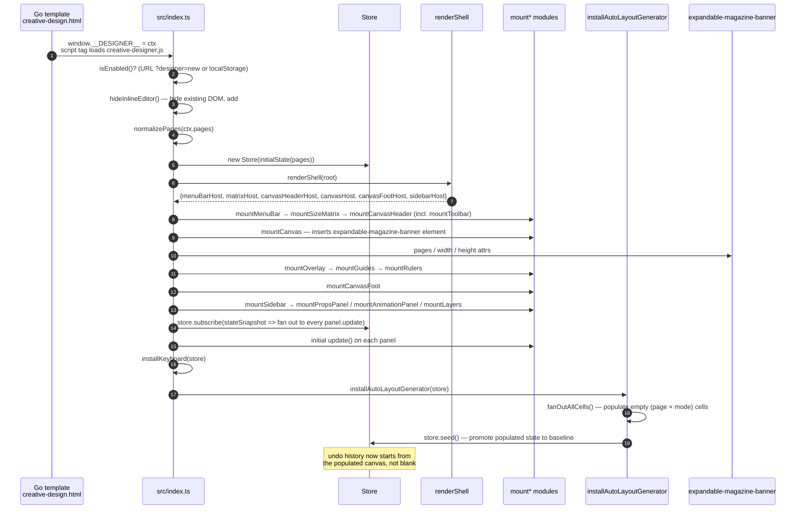
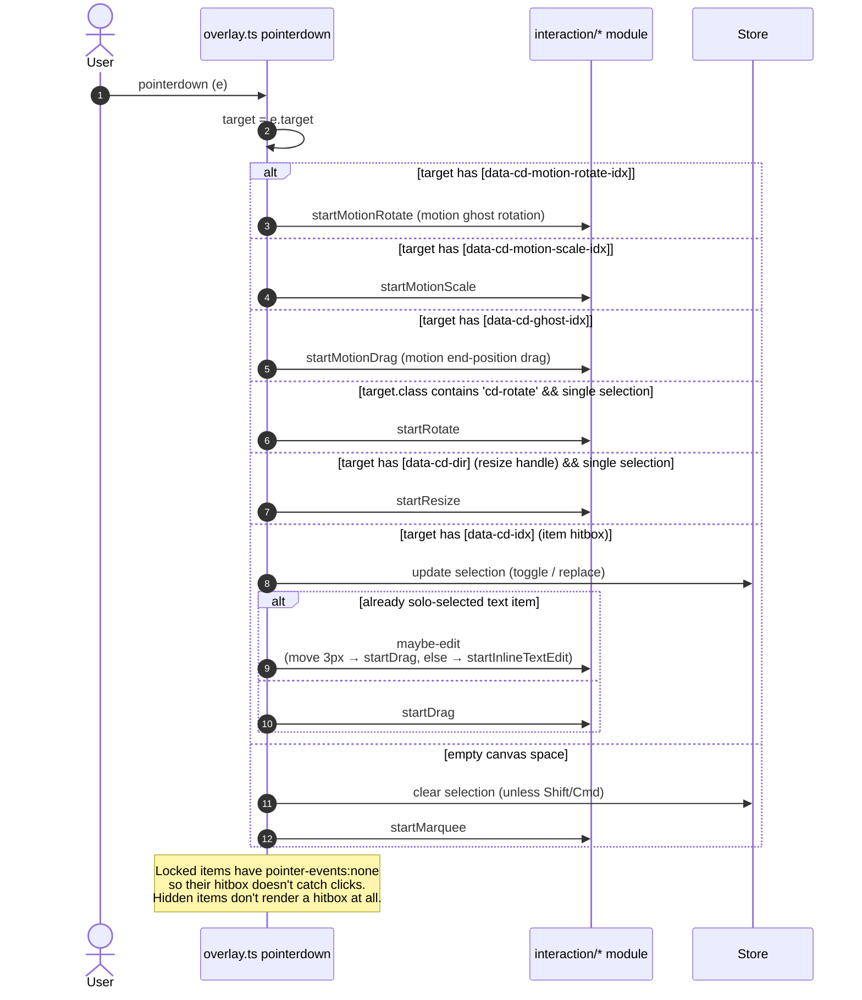
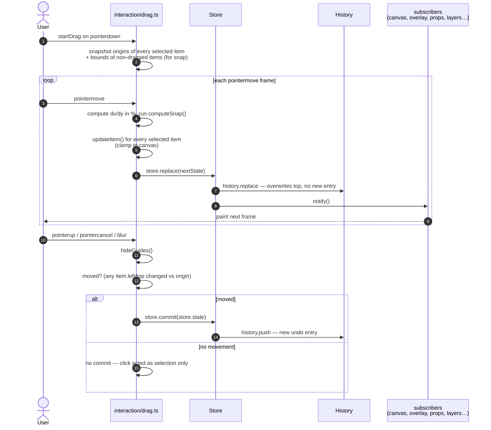
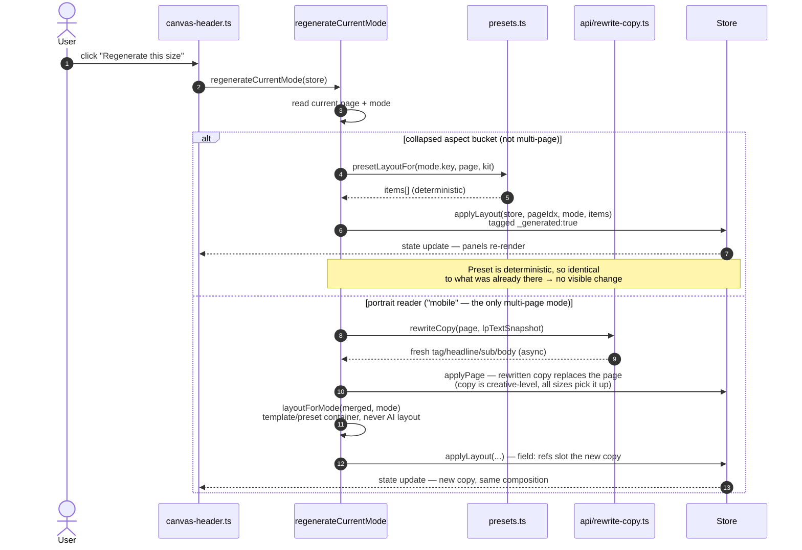
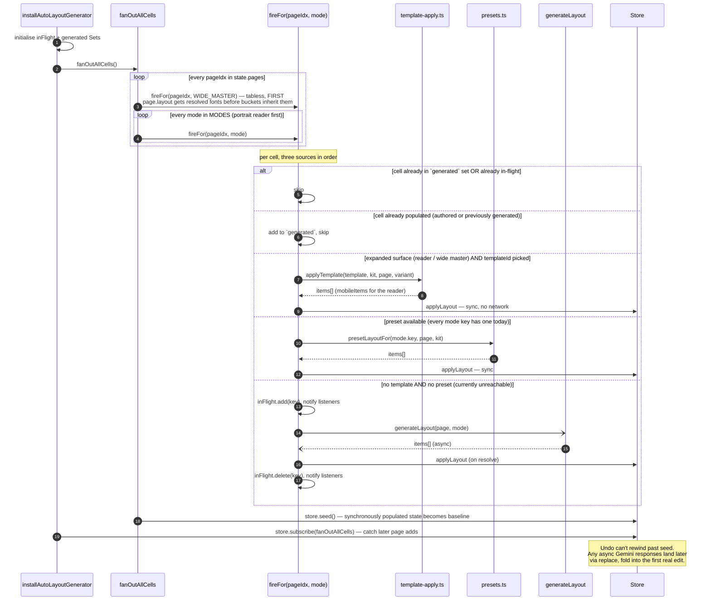

# Creative Designer — Key Flows

Sequence diagrams for the six flows most worth having a mental model of when
picking up work on this module. Each diagram is small on purpose — it answers
one question. Read alongside the source files it references.

Diagrams are Mermaid; they render natively on GitHub and in most Markdown
previewers.

---

## 1. Boot

*What happens between the page loading and the canvas becoming interactive.*

**Key files:** `src/index.ts`, `src/store.ts`, `src/auto-layout.ts`.

---

## 2. Pointerdown on canvas — which gesture starts?

*How a single click/drag dispatches to rotate / resize / drag / marquee.
Reading `src/render/overlay.ts::pointerdown` alongside this diagram makes it
obvious.*

**Key files:** `src/render/overlay.ts`, `src/interaction/*.ts`.

---

## 3. Drag — one undo step per gesture

*Why dragging 500 frames produces one history entry, not 500. The
replace-vs-commit split is the heart of the editor; every interaction
module uses it.*

**Key files:** `src/interaction/drag.ts`, `src/store.ts`, `src/history.ts`.

**Pattern to remember:** every gesture follows this shape.
`replace` during the gesture (navigation / transient), `commit` at the end
(undoable). Selection changes go through `replace` too — undo skips over
them by design.

---

## 4. Regenerate — per-banner regeneration

*Why "Regenerate this size" is a visual no-op on the aspect-bucket tabs
but rewrites the copy on the portrait reader. See
[auto-layout.ts::regenerateCurrentMode](src/auto-layout.ts).*

**Key files:** `src/auto-layout.ts`, `src/presets.ts`, `src/api/rewrite-copy.ts`.

**Why layout is never AI-generated here:** Gemini free-styling layouts
produced landscape 50/50 compositions on portrait canvases even with
hard hints. The layout container stays deterministic (template or
preset); Gemini's only job is rewriting the copy.

---

## 5. Auto-layout fanout — populating empty cells at boot

*Why every tab starts with content on a fresh creative even though the
server sent empty pages — and why the tabless 16:9 wide master fires
first. Reading this diagram alongside
[auto-layout.ts](src/auto-layout.ts) shows how the `generated` and
`inFlight` Sets prevent duplicate work.*

**Key files:** `src/auto-layout.ts`, `src/presets.ts`, `src/template-apply.ts`.

**Behaviour:** every cell fills synchronously at boot (template or
preset — no network), including the tabless wide master, which exists
as a delivery artifact for wide collapsed slots and legacy readers
even though it can't be hand-edited. The Gemini branch is kept for a
future template that excludes itself from a mode; today every mode key
has a preset, so it never fires during fanout.

---

## 6. Save draft / Publish

*The only flow that hits the Go handler. Everything else is client-only.*

```mermaid
sequenceDiagram
    autonumber
    actor User
    participant SaveBtn as save.ts
    participant Form as hidden <form>
    participant Go as platform/internal/handler
    participant Core as modules/api (Pekko)
    participant DB

    User->>SaveBtn: click "Save Draft" or "Publish"
    SaveBtn->>SaveBtn: submitSave(store, ctx, draft)
    SaveBtn->>Form: build hidden form<br/>pagesJson = JSON.stringify(store.state.pages)<br/>+ campaignId, name, landingUrl, w, h, draft?, creativeId?
    Form->>Go: POST /advertiser/creatives/save
    Go->>Core: proxy to /v1/advertisers/me/creatives
    Core->>DB: upsert creative row (id stable across draft → publish)
    Core-->>Go: 200 + creativeId
    Go-->>User: redirect (full-page reload)
    Note over SaveBtn,Form: Uses a <form> submit not fetch,<br/>so the server drives navigation and<br/>the page fully reloads with the new state.
```

**Key files:** `src/ui/save.ts`, `platform/internal/handler/pages.go`,
`modules/api/src/main/scala/promovolve/api/EndpointRoutes.scala`.

**Behaviour:** draft and publish hit the same endpoint; the `draft` flag is
the only functional difference. The `creativeId` is preserved across repeated
saves so we overwrite the same row rather than creating orphans. Full-page
reload on response — there's no SPA-style in-place refresh yet.

---

## How these fit together

- Flows **1, 4, 5** are boot / bulk-state flows. They run once or on explicit
  user action; they never fire per-frame.
- Flows **2, 3** are the interaction hot path. Read them together — every
  other gesture module (resize, rotate, motion-drag, motion-rotate,
  motion-scale, text edit) is a variation on flow 3's shape.
- Flow **6** is the only flow that crosses the client/server boundary for
  content (asset upload is the other, through a separate modal code path).

## Tips for reading the code

- Start with **flow 1** (boot), open every file it mentions, skim one level
  deep — you'll have seen most of the codebase once through.
- Then pick a gesture from **flow 2** and trace it. Resize is the easiest;
  drag is the canonical one.
- **`store.commit`** vs **`store.replace`** is the single most important
  distinction in this codebase. If in doubt: does this fire many times per
  second? → `replace`. Does the user expect Cmd+Z to undo it? → `commit`.

## Editing these diagrams

GitHub renders Mermaid with `securityLevel: 'strict'`, which is stricter
than the local `mmdc` CLI. Two pitfalls that have bitten us:

- **`;` is a statement separator.** Inside a message label, write
  `inFlight.add(key), notify listeners`, not `inFlight.add(key); notify
  listeners` — the second form ends the message early and the next line
  fails to parse.
- **Raw HTML tags get stripped.** `<script src="...">` and
  `<expandable-magazine-banner>` in a label render fine locally but
  disappear (or break the line) on GitHub. Rephrase to plain text
  (`script tag loads creative-designer.js`,
  `expandable-magazine-banner element`). ` ` is the only HTML that's
  safe — it's a Mermaid-recognised line break.

When a diagram looks wrong on GitHub, render it locally first with
`npx -p @mermaid-js/mermaid-cli mmdc -i diag.mmd -o diag.svg`. If it
renders locally too, the bug is real syntax; if not, it's a sanitiser
mismatch and the fix is in this list.
